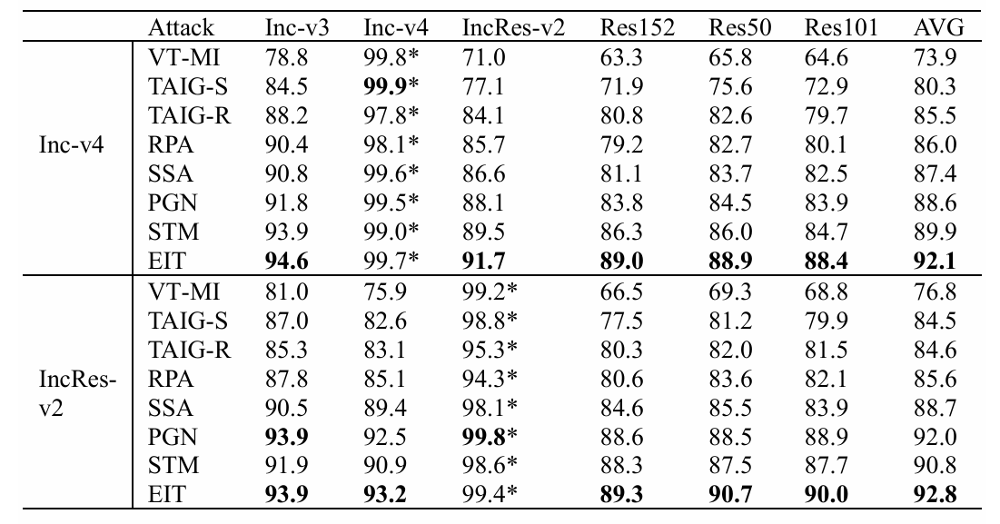

# A Whale Falls, All Thrive: Mitigating Attention Gap To  Improve Adversarial Transferability (details will be completed as soon as acception)

## requirements
- python 3.8.16 
- pytorch 1.13 + cu11.7 
- timm 0.9.7 
- numpy 1.24.3
- scipy 1.10.1 
- pretrainedmodels 0.7.4 
- pandas 2.0.1 


## Run attacks 
- **Prepare Data**: We have placed the ImageNet-compatible dataset under the './dataset' folder. <br/>

- **Prepare model**:  Download pretrained PyTorch models [tf to torch](github.com/ylhz/tf_to_pytorch_model) , which are converted from widely used Tensorflow models. Then, the model source code and weight are respectively place in './torch_nets' and './torch_nets_weight'.  <br>

  These models include inception-v3, inception-v4, inception-resnet-v2, resnet152, resnet50, resnet101. <br>

  In addition, adversarial models include adv_inception_v3(Inc-v3adv), ens3_adv_inception_v3(Inc-v3ens3), ens4_adv_inception_v3(Inc_v3ens4), ens_adv_inception_resnet_v2(IncRes-v2ens)

- **Generate adversarial examples** <br>

  Using `attack.py` to implement our "EIT" attack, you can run this attack as following  <br>
  ```bash 
  python attack.py --output_dir outputs --batch_size 10  <br>
  ```
  make sure to run GPU enviroment. And adversarial examples will be generated in './outputs'.

- **Evaluations on normally trained models** <br> please run 'main.py' evaluate the attack success rate <br>
  ``` bash 
  python main.py --adv_dir "./outputs" 
  ```
- **Evaluations on adversarial trained models** <br>

  similar, run 'main.py' evaluate the attack success rate  <br>

- **Evaluations on Visual transformers models**<br>

  please run 'verify.py' evaluate the attack success rate <br>
  ```bash
     python verify.py --adv_dir "./outputs"
  ```


- Defense methods 

  - [JPEG](https://github.com/JHL-HUST/VT/blob/main/third_party/jpeg.py): Refer to [here](https://github.com/JHL-HUST/VT/blob/main/third_party/jpeg.py)
  - [FD](github.com/JHL-HUST/VT/blob/main/third_party/feature_distillation.py): Refer to [here](https://github.com/JHL-HUST/VT/blob/main/third_party/feature_distillation.py)
  - [Bit-Red](github.com/JHL-HUST/VT/blob/main/third_party/bit_depth_reduction.py): Refer to [here](github.com/JHL-HUST/VT/blob/main/third_party/bit_depth_reduction.py)
  - [NRP](https://github.com/Muzammal-Naseer/NRP): purifier=NRP, dynamic=True, base_model=Inc-v3<sub>*ens3*</sub>. Download it from corresponding official repo.

## Result 



## Acknowledgments

Code refers to [TAIG](https://github.com/yihuang2016/TAIG) , [SSA](https://github.com/yuyang-long/SSA) , [STM](https://github.com/zhijin-ge/stm) , [PGN](https://github.com/Trustworthy-AI-Group/PGN)

